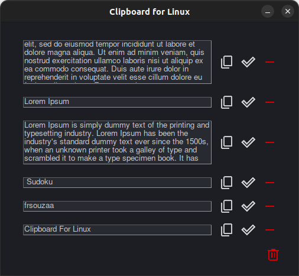

### Clipboard For Linux

If you just want to use the project and don't care about the code itself, just go to the branch releases and download it.

Dependencies: 
- xdotool
- xsel
- pyinstaller (probably you'll have to install it as super user)

